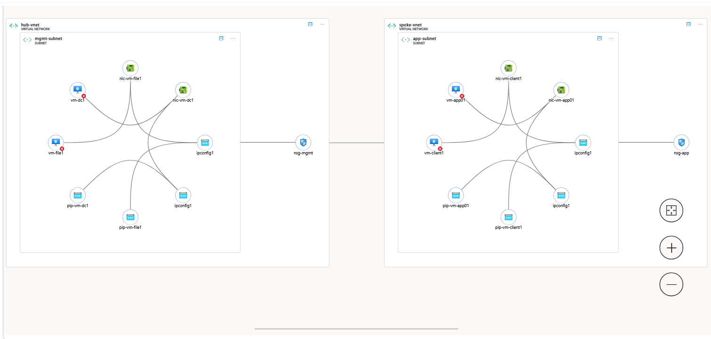
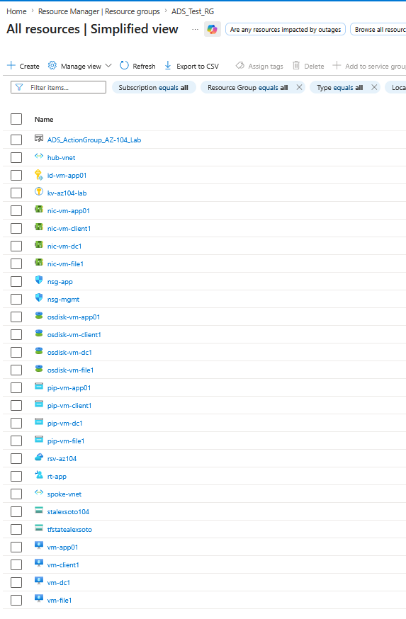
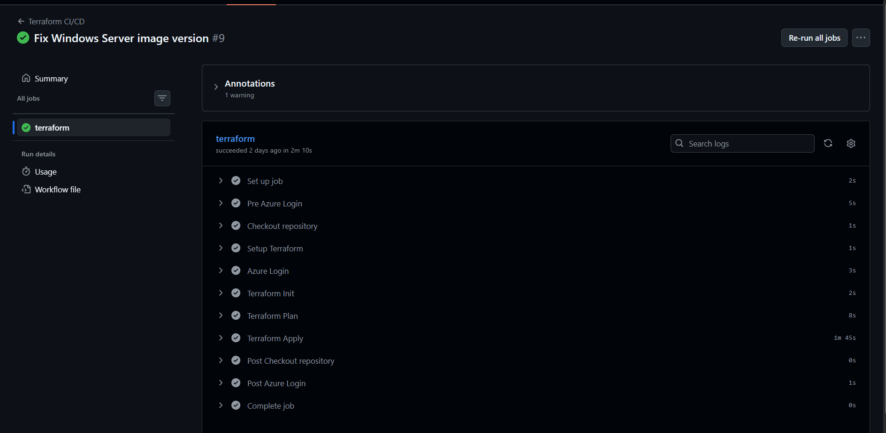
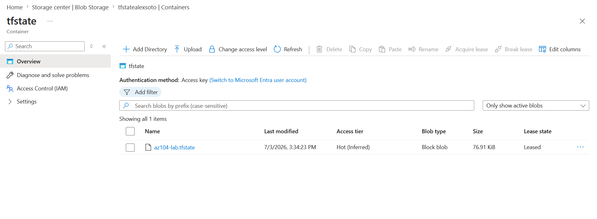
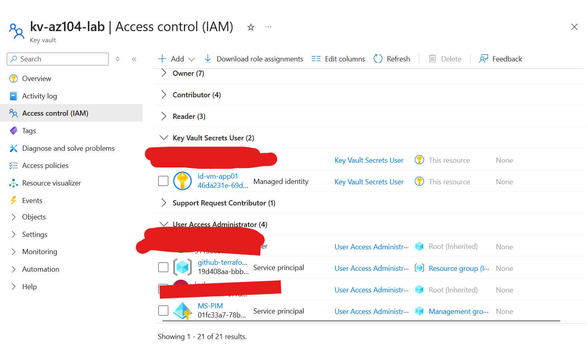
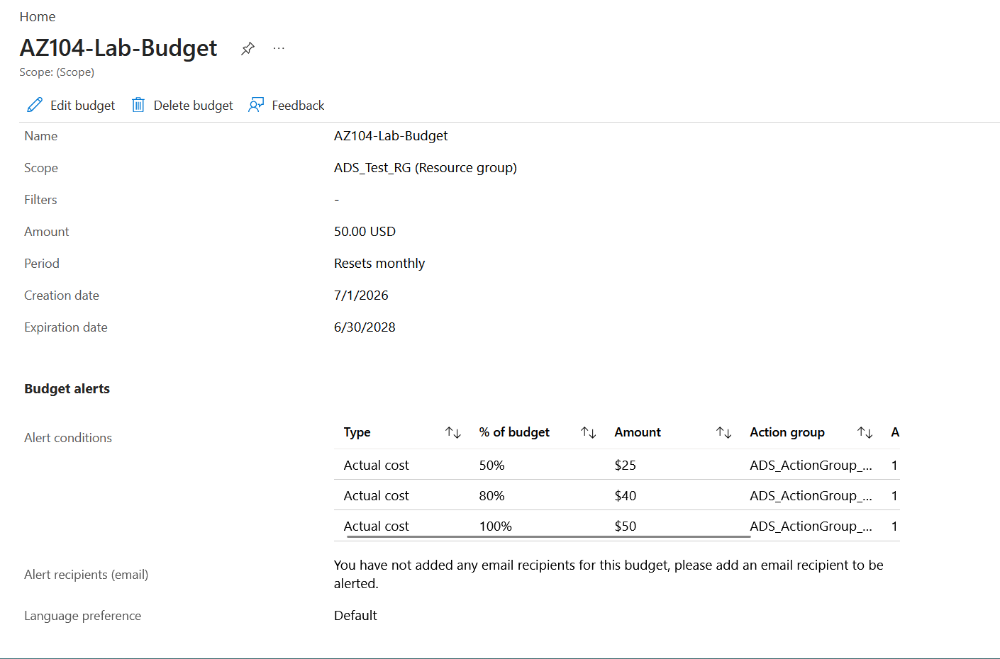

# Azure Hub-Spoke Lab Environment with Terraform CI/CD

This project deploys a complete Azure hub-and-spoke lab environment using modular Terraform and GitHub Actions.

The lab was built to demonstrate real-world Azure administration, Infrastructure as Code (IaC), CI/CD automation, remote state management, security controls, and cost governance.

Technologies used:

- Azure
- Terraform
- GitHub Actions
- Azure Storage
- Azure Key Vault
- Managed Identity
- Azure RBAC
- Windows Server
- Windows 11

---

## Architecture Overview

This environment uses a hub-and-spoke network topology.

### Hub Network

```text
hub-vnet
Address Space: 10.0.0.0/16

mgmt-subnet
10.0.1.0/24

VMs:
- vm-dc1
- vm-file1
```

### Spoke Network

```text
spoke-vnet
Address Space: 10.1.0.0/16

app-subnet
10.1.1.0/24

VMs:
- vm-client1
- vm-app01
```

### Connectivity

```text
hub-vnet <--> spoke-vnet
```

The spoke subnet is associated with a route table and network security group to simulate enterprise network segmentation.

### Network Topology




---

## Deployed Resources

### Networking

- Hub VNet
- Spoke VNet
- Management subnet
- Application subnet
- NSGs
- Route table
- Hub-to-spoke VNet peering
- Spoke-to-hub VNet peering

### Compute

- vm-dc1 (Windows Server 2019)
- vm-file1 (Windows Server 2019)
- vm-client1 (Windows 11 Pro)
- vm-app01 (Windows 11 Pro)

### Storage

- Azure Storage Account
- Blob Container
- Azure Files Share

### Identity & Security

- User Assigned Managed Identity
- Azure RBAC Role Assignment
- Azure Key Vault
- GitHub Secrets

### Recovery

- Recovery Services Vault

### Resource Group Deployment




---

## CI/CD Pipeline

This project uses GitHub Actions to automate Terraform deployments.

Pipeline workflow:

1. Checkout Repository
2. Azure Authentication
3. Terraform Init
4. Terraform Plan
5. Terraform Apply

GitHub repository secrets are used for authentication.


### Reproducing the GitHub Actions Deployment

To use the included GitHub Actions workflow, create the following repository secrets:

```text
AZURE_CREDENTIALS
ARM_CLIENT_ID
ARM_CLIENT_SECRET
ARM_SUBSCRIPTION_ID
ARM_TENANT_ID
```

These values should belong to an Azure Service Principal with permissions to deploy resources into the target subscription.

### GitHub Actions Deployment




---

## Remote State Management

Terraform state is stored remotely in Azure Blob Storage using the AzureRM backend.

Benefits:

- Persistent Terraform state
- State locking
- Protection from lost local state
- Consistent GitHub Actions deployments

```hcl
backend "azurerm" {
  resource_group_name  = "ADS_Test_RG"
  storage_account_name = "tfstatealexsoto"
  container_name       = "tfstate"
  key                  = "az104-lab.tfstate"
}
```

### Remote State Storage



---

## Security Controls

Implemented security controls include:

- Azure Key Vault
- Azure RBAC
- User Assigned Managed Identity
- GitHub Secrets
- Network Security Groups
- Restricted RDP Access
- Remote Terraform State

### Key Vault & Managed Identity

Azure Key Vault has been deployed to support centralized secret management.

The environment also includes a User Assigned Managed Identity for `vm-app01` and RBAC-based access control.

Planned Enhancement:

```text
Terraform retrieves VM administrator credentials
directly from Azure Key Vault.
```

### Security Resources



---

## Cost Management

To maintain a low-cost lab environment, the following controls were implemented:

- Azure Budget Alerts
- Resource Group Cost Analysis
- VM Auto Shutdown
- Budget Monitoring
- Low-cost VM sizing

Target monthly budget:

```text
< $50/month
```

Primary cost drivers:

```text
Virtual Machines
```

### Budget Monitoring



---

## Key Accomplishments

- Built reusable Terraform modules
- Designed and deployed a hub-and-spoke Azure network
- Implemented GitHub Actions CI/CD
- Configured Azure Storage remote state
- Implemented Azure RBAC and Managed Identity
- Deployed Azure Key Vault
- Implemented Azure cost governance using budgets and alerts
- Automated deployment of Azure infrastructure through Infrastructure as Code

---

## Deploying in Your Own Azure Tenant

This project was originally built and tested in a personal Azure lab environment. To deploy it successfully in another Azure tenant, complete the following steps.

### Step 1 - Clone the Repository

```bash
git clone <repository-url>
cd <repository-folder>
cd terraform
```

---

### Step 2 - Create an Azure Resource Group

This project assumes an existing Resource Group and does not create one automatically.

Example:

```bash
az group create \
  --name ADS_Test_RG \
  --location eastus
```

Alternatively, update the value of:

```hcl
resource_group_name
```

inside `terraform.tfvars`.

---

### Step 3 - Create a Storage Account for Terraform State

This repository references a Terraform backend from my personal lab environment:

```hcl
backend "azurerm" {
  resource_group_name  = "ADS_Test_RG"
  storage_account_name = "tfstatealexsoto"
  container_name       = "tfstate"
  key                  = "az104-lab.tfstate"
}
```

Before deploying in your own tenant, create a Storage Account and Container for Terraform state.

Example:

```bash
az storage account create \
  --name mytfstateacct \
  --resource-group ADS_Test_RG \
  --location eastus \
  --sku Standard_LRS

az storage container create \
  --name tfstate \
  --account-name mytfstateacct
```

Update the backend block to reference your own values:

```hcl
backend "azurerm" {
  resource_group_name  = "ADS_Test_RG"
  storage_account_name = "mytfstateacct"
  container_name       = "tfstate"
  key                  = "az104-lab.tfstate"
}
```

Terraform will not initialize successfully until these backend values are updated to reference Azure resources that exist in your own environment.

---

### Step 4 - Create terraform.tfvars

The real `terraform.tfvars` file is intentionally excluded from source control.

Copy:

```text
terraform/terraform.tfvars.example
```

Create:

```text
terraform/terraform.tfvars
```

Example:

```hcl
resource_group_name  = "ADS_Test_RG"

location             = "eastus"

admin_username       = "azureadmin"

admin_password       = "ReplaceWithPassword"

home_public_ip       = "X.X.X.X/32"

storage_account_name = "youruniquestorageaccount"
```

Update all values for your environment.

---

### Step 5 - Authenticate to Azure

Login:

```bash
az login
```

Verify subscription:

```bash
az account show
```

If needed:

```bash
az account set --subscription "<subscription-id>"
```

---

### Step 6 - Deploy Locally

Ensure Terraform 1.5+ is installed and available in your system PATH.

Initialize Terraform:

```bash
terraform init
```

Review the plan:

```bash
terraform plan
```

Deploy:

```bash
terraform apply
```

Verify the deployment:

```bash
terraform output
```


Expected resources include:

- 4 Virtual Machines
- 2 Virtual Networks
- Storage Account
- Recovery Services Vault
- Managed Identity
- Azure Key Vault

---

### Step 7 - Configure GitHub Actions (Optional)

At a minimum, the Service Principal should have Contributor access to the target Resource Group.

If role assignments are being deployed through Terraform, additional permissions such as User Access Administrator may also be required.

To use the included CI/CD pipeline, create an Azure Service Principal.

Example:

```bash
az ad sp create-for-rbac \
  --name github-terraform-lab \
  --role Contributor \
  --scopes /subscriptions/<subscription-id>
```

The command will return JSON output similar to:

```json
{
  "clientId": "...",
  "clientSecret": "...",
  "subscriptionId": "...",
  "tenantId": "..."
}
```

Use these values to populate the GitHub repository secrets.


Create the following GitHub repository secrets:

```text
AZURE_CREDENTIALS
ARM_CLIENT_ID
ARM_CLIENT_SECRET
ARM_SUBSCRIPTION_ID
ARM_TENANT_ID
```

These values should correspond to an Azure Service Principal with permissions to deploy resources into the target subscription.

After configuring the secrets, the included GitHub Actions workflow can automatically execute:

```text
Terraform Init
Terraform Plan
Terraform Apply
```

---

### Cost Considerations

This project creates:

- 4 Virtual Machines
- Azure Storage Account
- Recovery Services Vault
- Public IP Addresses
- Virtual Networks

These resources will incur Azure charges.

To help control costs, the lab includes:

- VM Auto Shutdown
- Azure Budget Alerts
- Cost Analysis Monitoring

This project is designed to use Azure Blob Storage for remote Terraform state. Before deploying in another Azure tenant, update the backend configuration to reference your own Storage Account and Container.

---


## Future Enhancements

- Azure Defender for Cloud
- Just-In-Time VM Access
- Log Analytics Workspace
- Azure Bastion
- Backup Policies
- Azure Policy Assignments
- Bicep Version of the Environment
- Private Endpoints

---

## Skills Demonstrated

- Terraform
- Infrastructure as Code
- Azure Networking
- Hub-and-Spoke Architecture
- Azure Virtual Machines
- Azure Storage
- Azure RBAC
- Managed Identities
- Azure Key Vault
- GitHub Actions
- CI/CD
- Azure Cost Management
- Network Security Groups
- Cloud Automation

---

## Resume Summary

```text
Designed and deployed a modular Azure hub-and-spoke environment using Terraform and GitHub Actions, including VNets, NSGs, route tables, Windows virtual machines, Azure Storage, Recovery Services Vault, Azure RBAC, Managed Identity, Azure Key Vault, remote Terraform state, CI/CD automation, and Azure cost governance controls.
```

---

## Author

Alex Soto

IT Support | Software Development | Master's Degree in Software Development @ Dominican Univeristy, River Forest, IL

Certifications:

- SC-300 Identity and Access Administrator
- MD-102 Endpoint Administrator

---

## License

MIT License
